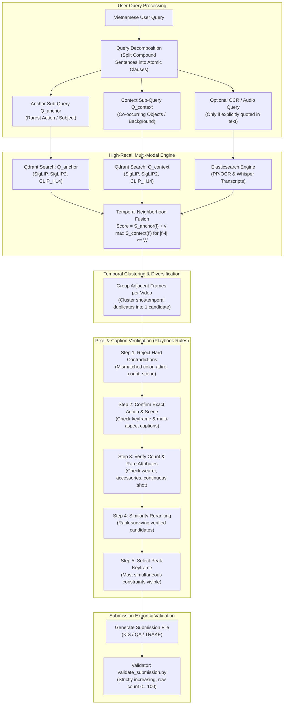
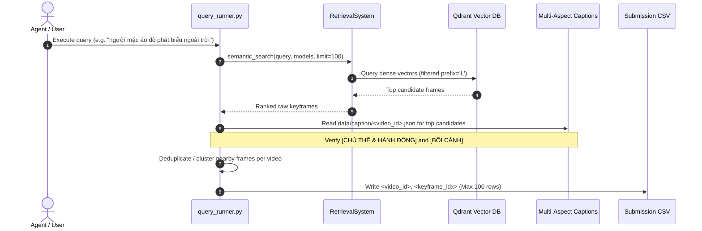
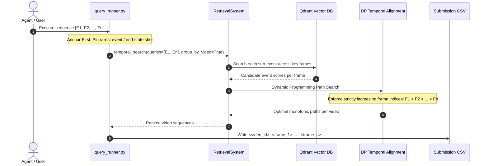

# Retrieval Architecture & Workflow Diagrams

This document provides visual Mermaid workflows and architecture diagrams for the AIC 2026 Multimodal Video Retrieval Engine.

---

## 1. End-to-End System Architecture

---

## 2. Query Type Workflows

### A. Textual KIS (Known Item Search)

---

### B. TRAKE (Temporal Retrieval and Alignment of Key Events)

